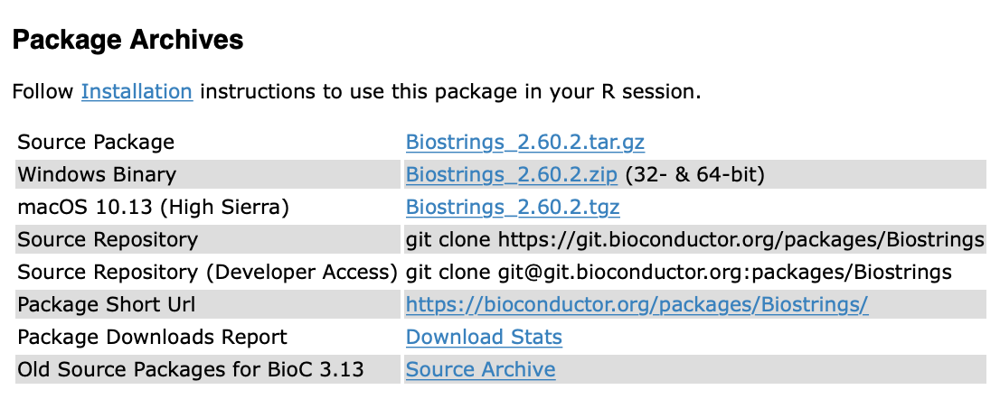

# Compilación e instalación de paquetes

Joselyn Cristina Chávez Fuentes

30 de octubre de 2024

## Diapositivas

[
```{r,echo=FALSE}
knitr::include_url("https://comunidadbioinfo.github.io/cdsb2024/compilacion_paquetes.html", height = "380px")
```
](https://comunidadbioinfo.github.io/cdsb2024/compilacion_paquetes.html)


## Metadatos de una paquetería

Los metadatos de la paquetería se encuentran en el archivo DESCRIPTION.

### Description

El campo Description describe lo que hace tu paquetería. Suele ser extenso, si requieres escribir múltiples líneas, deben estar indentadas. 


Por ejemplo:

```{r}
# Description: Este paquete contiene todas las funciones generadas en el curso 
#   de escritura de paqueterías en R. También contiene las funciones que cada 
#   participante propuso para solucionar un problema relacionado con su trabajo.
```


### Dependencias

Las dependencias son las paqueterías que tu paquete necesita para funcionar. La lista de paquetes se escribe separada por comas y es recomendado que se escriban en orden alfabético.

Existen tres tipos:

- **Imports**: Son paquetes que deben instalarse para que tu paquete funcione y por tanto se van a instalar en el momento que instales el paquete. Internamente existe una función que evalúa si los paquetes se encuentran instalados o no y solamente instala los faltantes. 

Esta dependencia hace solamente la instalación pero no ejecuta library(), por lo que los paquetes requeridos deberán ser cargados dentro de la escritura del paquete.

- **Depends**: Son paquetes que obligatoriamente deben estar para que tu paquetería funcione pero no se instalarán de manera automática. Aquí también se indica la versión de R requerida para el funcionamiento del paquete. Los paquetes que se listen aquí se van a cargar al mismo tiempo que se ejecute el library(mipaquete).

- **Suggests**: Se refiere a los paquetes que tu paquete puede utilizar y aprovechar para ser más poderoso en el análsis pero no los necesita para funcionar. Por ejemplo, paquetes que contienen sets de datos para hacer pruebas o análisis de práctica.


**Nota Importante**

Se recomienda listar los paquetes necesarios para el funcionamiento de nuestro paquete en _Imports_ porque cuando se ponen en _Depends_ se cargan los paquetes completos y probablemente solamente requerimos una o dos funciones. 

Cargar demasiados paquetes completos, sin ser necesario, sólo hace que nuestro paquete se vuelva pesado y lento. Es mejor llamar particularmente a las funciones usando la sintaxis explícita:

```{r, eval=FALSE}
Biostrings::translate()
```


### ¿Cómo añadir dependencias?

- Usando usethis:

```{r, eval=FALSE}
usethis::use_package("ggplot2", type = "Imports")
```

- Editando manualmente el archivo DESCRIPTION. 


## Licencias

Establece quién puede usar tu paquete. Existen diversas licencias pero hablaremos sobre las 3 más comunes:

- MIT (Massachusetts Institute of Technology): es simple y permisiva. Permite a cualquier persona usar y distribuir tu paquetería con una sola restricción: la distribución debe incluir la declaración de licencia del autor. Existe un texto base al cual se le pueden añadir cláusulas o excepciones. Este es un ejemplo:


```{r, echo=FALSE,fig.align='center', out.width='90%'}

```


- GPL-2 (General Public License): Permite usar y distribuir tu código con la condición que si se genera una versión modificada de tu código, su distribución debe ser también bajo esta licencia. Aunque está enfocada a la distribución de código abierto, permite dejar en claro quién es el autor del material y evitar la apropiación del código por terceros. Un ejemplo de la aplicación de esta licencia es el desarrollo de Linux.

- CCO: Esta licencia implica que cedes todos los derechos y el código puede ser utilizado con cualquier fin, excepto fines comerciales. Es el más utilizado en los paquetes. Concede el derecho a utilizar y distribuir el material sin requerir el permiso del autor.


## Paqueterías de código fuente

En algunas ocasiones necesitaremos instalar paquetes que no se encuentran compilados, por ejemplo: 

- Paquetes en desarrollo de CRAN o Bioconductor.
- Versiones anteriores de paquetes de CRAN o Bioconductor.
- Paquetes que no se encuentran depositados en CRAN o Bioconductor, sino en repositorios personales como GitHub.
- Paquetes que estás desarrollando de forma local.

El paquete **remotes** será de gran utilidad.

Regularmente, los paquetes que instalamos desde algún repositorio como CRAN o Bioconductor son paquetes binarios que ya se encuentran compilados previamente.

Existen algunas funciones que nos permiten instalar paquetes desde código fuente. Anteriormente, se solían utilizar las funciones install_* del paquete devtools; sin embargo, recientemente se creó el paquete **remotes** que contiene las mismas funciones pero está específicamente diseñado para ayudarnos a trabajar con paquetes desde código fuente.

## ¿En dónde podemos encontrar el código fuente de un paquete?

Si el paquete se encuentra disponible en CRAN, puedes encontrar el link al código fuente en la sección URL.

```{r,echo=FALSE,out.width='50%', fig.align='center'}
knitr::include_graphics("img/source.png")
```


Si el paquete se encuentra disponible en Bioconductor, puedes encontrar el link al código fuente en la sección Package Archives

```{r,echo=FALSE,out.width='50%', fig.align='center'}

```

Si el paquete se encuentra en GitHub o GitLab, necesitarás conocer el nombre de usuario y el nombre del paquete.


## Instalando la última versión en desarrollo

- Si el paquete se encuentra depositado en CRAN podemos usar la función 

```{r,eval=FALSE}
remotes::install_dev("pkgname")
```

Por ejemplo, para instalar la versión en desarrollo de dplyr usaremos el comando
```{r,eval=FALSE}
remotes::install_dev("dplyr") 
```


- Si el paquete se encuentra en Bioconductor usaremos la siguiente función:

```{r,eval=FALSE}
remotes::install_bioc("pkgname")
```

Por ejemplo, para instalar la versión en desarrollo de regutools, el paquete desarrollado por miembros de la CDSB, usaremos el comando

```{r,eval=FALSE}
remotes::install_bioc("regutools")
```


## Instalando paquetes desde GitHub

Para poder instalar un paquete desde GitHub necesitaremos conocer el usuario del creador y el nombre del repositorio.

```{r,eval=FALSE}
remotes::install_github("usuario/repositorio")
```

Por ejemplo, para instalar el paquete starwarssay desarrollado por Erick Cuevas (Erickcufe) utilizaremos el siguiente comando:

```{r,eval=FALSE}
remotes::install_github("Erickcufe/starwarssay")
```


Independientemente de si el paquete se encuentra en CRAN, Bioconductor, o ninguno de ellos, podemos instalar un paquete depositado en una cuenta de GitHub.

Para poder instalar un paquete desde GitHub necesitaremos conocer el usuario del creador y el nombre del repositorio donde se encuentra depositado el paquete. Con esta información usaremos la siguiente función:


## Instalando un paquete local

- Paso 1: Abre el proyecto del paquete que estás desarrollando.

- Paso opcional: Ejecuta la documentación si realizaste algún cambio.

```{r, eval=FALSE}
devtools::document()
```

- Paso 2: Construye el paquete:

```{r, eval=FALSE}
devtools::build()
```


- Paso 3: Instala el paquete desde tu proyecto actual:

```{r, eval=FALSE}
devtools::install()
```


## Contribuyendo código

Una ventaja de descargar el paquete de forma local es que puedes realizar cambios, probar que funciona de manera local y después contribuir (haciendo un pull-request).

Usemos el paquete **saludo** 

- Clona el repositorio en tu computadora.

```
git clone https://github.com/ComunidadBioInfo/saludo.git
```

Ahora puedes abrir el proyecto del paquete y agregar tu código. 

## Agregando datos de ejemplo en el paquete

Guarda el archivo con los datos de ejemplo en: inst/extdata.

Para acceder al archivo, usa el siguiente comando:

```{r, eval=FALSE}
datasets_file <- system.file("extdata", 
                             "datasets.csv", 
                             package = "mi_paquete")

read.csv(datasets_file)
```


